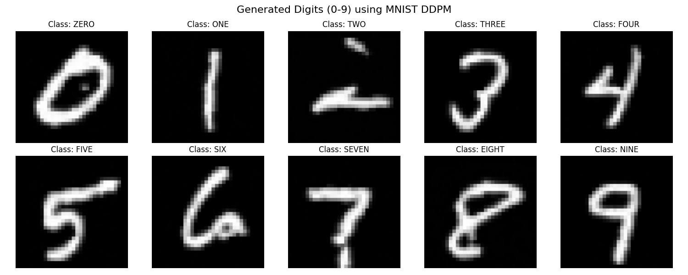

# MNIST Diffusion Model (DDPM)

While modern APIs make it incredibly easy to generate images with a single line of code, I wanted to deeply understand the fundamental mathematics powering state-of-the-art generative models. This repository contains a Denoising Diffusion Probabilistic Model (DDPM) that I built, mathematically formulated, and trained entirely from scratch using PyTorch.

There are no pre-trained weights or HuggingFace pipelines here—just pure tensor mathematics, a custom time-conditioned U-Net, and a 1000-step Markov chain. The model generates 32x32 images of hand-drawn digits conditioned on a class label (0-9).

## Features
- Custom **U-Net Architecture** with GroupNorm and time/label embeddings.
- Full support for conditional generation of specific digits.
- Early stopping based on MSE loss.
- High-quality upscaled output (using OpenCV).

## The Architectural Journey & Lessons Learned
Building this without training wheels meant confronting the exact mathematical walls that early AI researchers faced. Here are the three biggest architectural traps I encountered and how I engineered around them:

### 1. The 1-Shot MSE Blur (Why we need 1000 steps)
**The Trap:** My initial V1 model attempted to predict the final, clean image directly from a highly noisy state in a single step. Because the network is penalized by Mean Squared Error (MSE), it was mathematically "scared" of making a wrong guess and output a blurry, gray average of the dataset to play it safe.
**The Fix:** Instead of predicting the clean image, I changed the target to predict the **noise** itself. By subtracting tiny fractions of the predicted noise over 1000 sequential steps, the network can confidently carve out sharp, localized features.

### 2. The Normalization Mismatch (The "Rainbow Static" Bug)
**The Trap:** During my V2 upgrade, the network completely collapsed and output pure pastel rainbow static. 
**The Fix:** I realized my dataset tensors were scaled between `[0.0, 1.0]`, but the Gaussian noise I was injecting spanned from roughly `[-3.0, 3.0]`. The neural network was mathematically blinded by the collision. By re-centering the dataset pixels to `[-1.0, 1.0]` using `transforms.Normalize(mean=[0.5], std=[0.5])`, the input matched the noise distribution perfectly and the static disappeared.

### 3. The BatchNorm Poison
**The Trap:** Averaging pure noise with clean images across a single training batch completely destroys the statistical variance of the network. Using standard `nn.BatchNorm2d` caused the gradients to spin out of control.
**The Fix:** I rewrote the U-Net architecture to utilize `nn.GroupNorm`. This normalizes the channels independently for *each individual image* regardless of the batch size or the current noise level, instantly stabilizing the training math.

## Generated Images

### Generated from Initial Model (Overfitted)
These images show early results during training:

<p align="center">
  
  
  
</p>
<p align="center"><em>(See the `images/ddpm_overfit` directory for more examples)</em></p>

### Generated from Final Model (MNIST)
These images show the final generated digits:

<p align="center">
  
  
  
  
  
</p>
<p align="center"><em>(See the `images/mnist` directory for more examples)</em></p>

## Installation

1. Clone the repository:
   ```bash
   git clone git@github.com:akshaysatyam2/diffusion-model.git
   cd diffusion-model
   ```

2. Install the required dependencies:
   ```bash
   pip install -r requirements.txt
   ```

## Usage

### Training the Model
To train the model from scratch, simply run:
```bash
python main.py --mode train --epochs 150
```
This will download the MNIST dataset to `./data`, train the U-Net, and save the best checkpoint as `best_mnist_ddpm.pt`.

### Testing the Model
To test the model by generating a grid of all digits (0-9) and saving the result as `test_results.png`, run:
```bash
python test_model.py
```

<p align="center">
  
</p>

### Generating Images via CLI
To generate a digit using a trained model, run:
```bash
python main.py --mode generate --digit 8
```
*(Replace `8` with any digit from `0-9`)*

### Generating Images via Python API (Inference Engine)
You can load the trained weights and watch the model chisel a digit out of noise in your own scripts.

```python
import os
from src.generate import AkshayMNISTEngine

# Point to the trained weights
model_location = "best_mnist_ddpm.pt"

if os.path.exists(model_location):
    # Initialize the engine
    ai = AkshayMNISTEngine(model_location)
    
    # Generate any digit from 0 to 9! 
    # Because it starts from random noise, every generation is completely unique.
    ai.generate(target_digit=8) 
else:
    print("Error: Trained weights not found. Please run the training loop first.")
```

## Architecture Summary
- **Input:** 32x32 image (MNIST images are resized).
- **Embeddings:** Sinusoidal time embeddings and learnable class embeddings are projected and added to the bottleneck.
- **Blocks:** Convolutional blocks with GroupNorm and LeakyReLU activations.
- **Loss:** Mean Squared Error (MSE) between actual noise and predicted noise.

## Author
Akshay Kumar